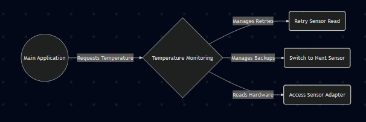

# Temperature Monitoring System
## Decorator Pattern Architecture
Presented by: [Your Name]

---

# General Description & Usage:

* The goal of this task is to extend the existing temperature monitoring system by introducing the Decorator pattern to improve reliability and separation of concerns.
* We are introducing two decorators to handle errors.
* The RetryDecorator manages retry logic if a sensor fails to return data. 
* The FallbackDecorator provides a backup sensor mechanism.

---

# Why Separate Decorators?:

* We built Retry and Fallback as separate decorators so each decorator has one responsibility.
* The RetryDecorator only handles retry logic and must not know anything about fallback processes or other sensors.
* The FallbackDecorator only handles fallback logic and must not perform retries. It also must not contain hardware logic or modify the underlying adapters.
* Keeping these decorators distinct prevents complex, fragile code.

---

# Architectural Changes:

* The factory used to simply selecte and returne a single raw adapter.
* The factory builds a list containing multiple base sensors then wraps these base sensors with the RetryDecorator if required. 
* Finally, it wraps the entire collection with the FallbackDecorator. As a result of this restructuring, no reliability logic may remain in the main application.
* The main function must only call the basic temperature retrieval method.

---

# Single Responsibility Principle:

* This architecture strongly satisfies the Single Responsibility Principle by isolating reliability logic inside the decorators, so the main application no longer needs to perform retries or check which sensor failed.
* Each decorator limits itself to one specific job.
* The system is easy to extend without having to modify the existing classes.
* We can add unlimited fallback layers simply by updating the list in the factory.

---

# Use Case Diagram

---

# Activity Diagram

---

# Class Diagram

---

#  Diagram

