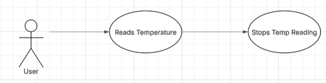
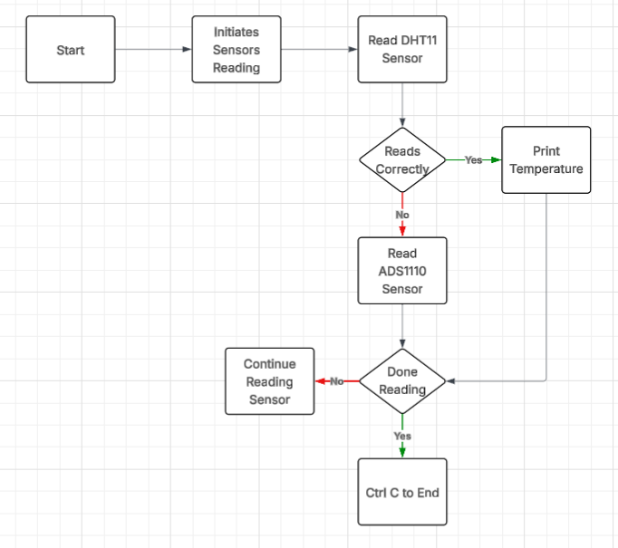
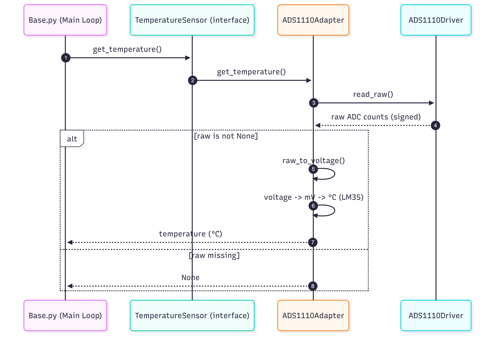
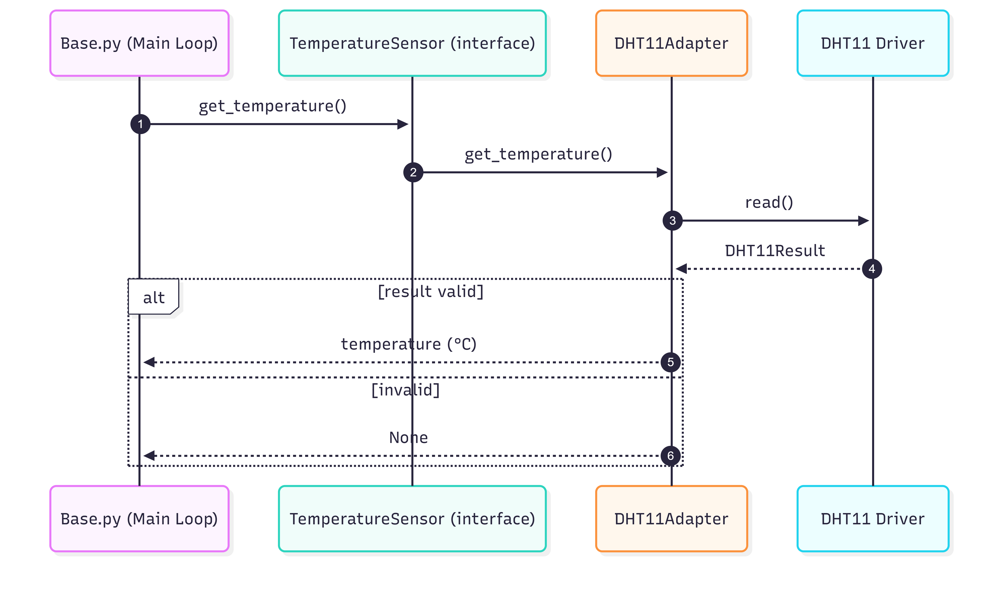
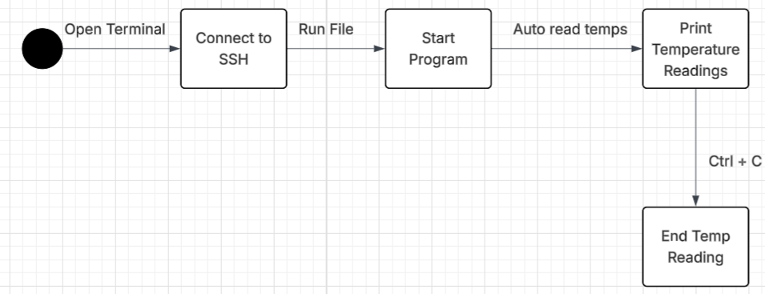

# Project 1 Adapter Pattern
## Overview
This project demonstrates the Adapter Design Pattern by providing a unified interface for reading temperature data from two different hardware sensors on a Raspberry Pi.
The system abstracts sensor-specific details behind a common TemperatureSensor interface, allowing client code to retrieve temperature readings without needing to know which sensor is being used or how it communicates with the hardware.

## The project supports:
A DHT11 digital temperature and humidity sensor
An ADS1110 analog-to-digital converter paired with an LM35 temperature sensor

## Features:
Common TemperatureSensor abstract base class
Adapter implementations for two different sensor types
Hardware access via the lgpio library
Separation of sensor drivers from application logic
Demonstrates real-world use of the Adapter Pattern in embedded systems

## Technology Used:
Python 3
Raspberry Pi GPIO and I2C
lgpio library
DHT11 temperature sensor
ADS1110 ADC with LM35 temperature sensor

## Adapter Pattern Usage: 
This project uses the Adapter Pattern to allow incompatible sensor interfaces to work together.
TemperatureSensor defines a common interface (get_temperature)
DHT11Adapter adapts the DHT11 sensor to this interface
ADS1110Adapter adapts the ADS1110 + LM35 setup to the same interface
This allows the rest of the system to work with temperature sensors generically, without hard-coding logic for specific hardware.

## Diagrams: 
1. Use Case Diagram:

   
2. Activity Diagram:

   
   
3. Sequence Diagram: 

  
  
4. Class Diagram:

   
5. State Diagram: 

