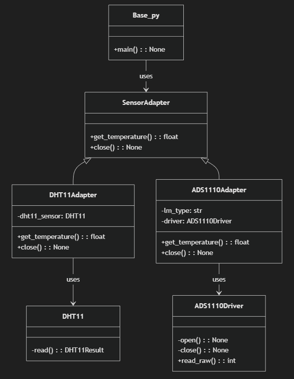
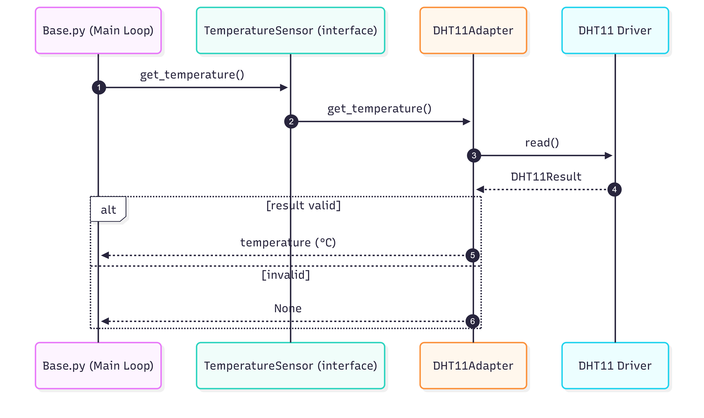

# Decorator Pattern Implementation

## Overview
This branch adds the Decorator pattern on top of the Adapter pattern from the main branch. The goal is to add retry and fallback behavior to sensors without changing the existing adapter classes.

Two decorators were implemented:
- `RetryDecorator` — retries a failed sensor read up to N times before giving up
- `FallbackDecorator` — tries sensors in order and returns the first successful reading

Both decorators implement `TemperatureSensor` so they can wrap each other or any adapter interchangeably.

## How the Decorator Pattern Works Here
The `TemperatureSensor` abstract class is the shared interface. Since both concrete adapters and decorators implement it, a decorator can wrap another decorator or a raw adapter — the client never knows the difference.

```python
# Example: DHT11 with 3 retries, ADS1110 as fallback
sensor = RetryDecorator(DHT11Adapter(pin=21), retries=3)
backup = ADS1110Adapter(lm_type="LM35")
final = FallbackDecorator([sensor, backup])
```

`RetryDecorator` attempts `get_temperature()` up to `retries + 1` times total. `FallbackDecorator` takes a list and iterates through until one returns a value.

## Files Changed from Main
- `Decorator.py` — new file with `RetryDecorator` and `FallbackDecorator`
- `Sensor_factory.py` — updated to apply decorators based on JSON config fields (`retries`, `fallback`, `fallbacks`)
- `Base.py` — unchanged, still works the same since decorators implement the same interface

## Running It
Same as main branch:
    python3 Base.py dht
    python3 Base.py ads
The factory handles applying decorators automatically based on the config.

## Diagrams


